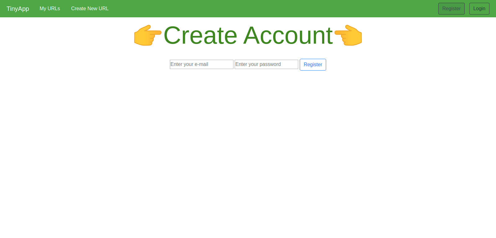
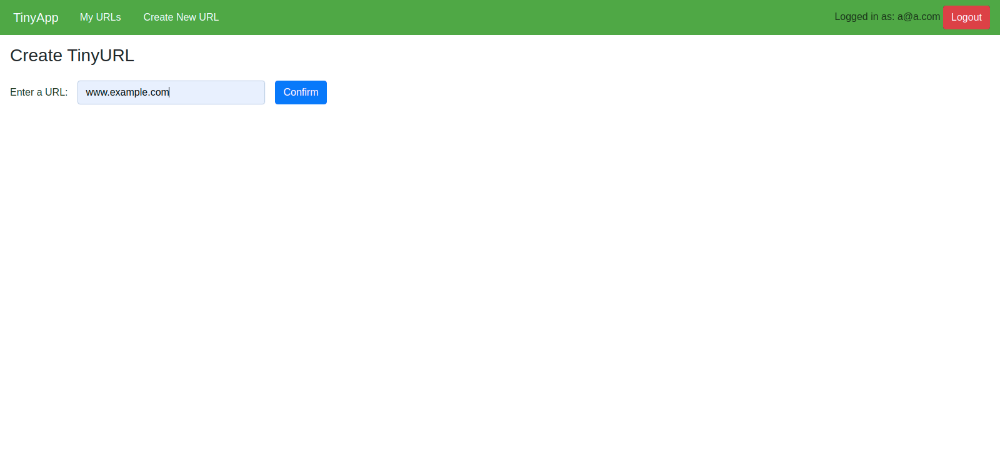
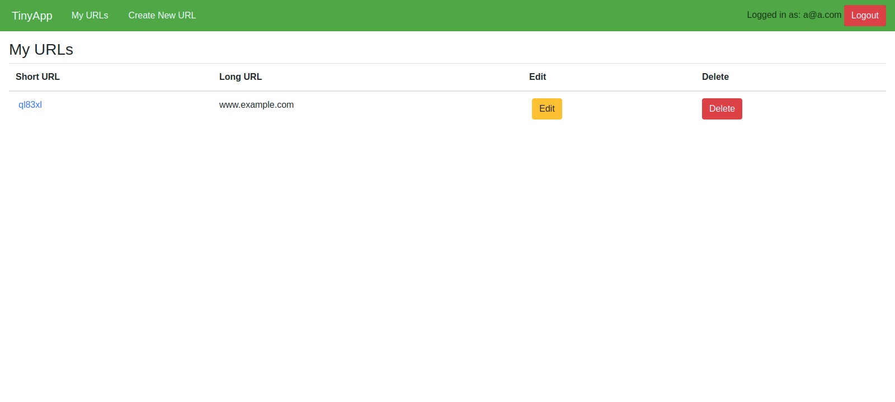

# TinyApp Project

TinyApp is a full stack web application built with Node and Express that allows users to shorten long URLs (à la bit.ly).

## Final Product

 This is the Home page. If a user is not logged in and try to access the "MyURLs" or "Create New URL", the user will be directed to the login screen.

##

This is the registration page. If a user Login ID is not found or if it is a new user then they can register. If the existing user try to register then it gives error saying "Email already registered, please login". 

##

This page is for creating a new URL, after a user has logged in. It also checks if the user has entered http:// in the front of the URL. If the user has not enetered then it add http:// to the URL.  

##

This is the My-URLS page where user can see all the links created and can edit or delete the link that is created. 

##

## Dependencies

- Node.js
- Express
- EJS
- bcrypt
- body-parser
- cookie-session

## Getting Started

- Install all dependencies (using the `npm install` command).
- Run the development web server using the `node express_server.js` command.